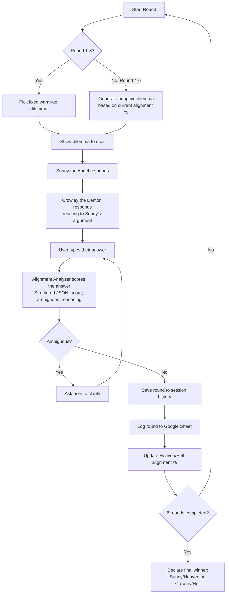

# Game Flow

This diagram shows the full flow of one round of the game, from the moment a dilemma is shown to the moment the alignment score is updated.

## Summary of the flow

1. **Dilemma selection** — the first 3 rounds use fixed warm-up dilemmas (covering sacrifice, honesty, and loyalty); the next 3 are generated live by GPT based on how the user has answered so far.
2. **Character responses** — Sunny answers first, then Crowley responds while reacting to what Sunny just said, so the two feel like they're actually debating rather than answering independently.
3. **User answers freely** — in any language, in any format (a word, a sentence, or a full explanation).
4. **Scoring** — a separate AI call (the alignment analyzer) scores the answer from -1.0 (fully selfish) to +1.0 (fully selfless), returned as structured JSON. If the answer is genuinely unclear, the user is asked to clarify instead of guessing.
5. **Logging** — every completed round is saved both in the app's session (for the in-game history view) and in a shared Google Sheet (for review after the fact — see [README.md](./README.md) for the link).
6. **Result** — after 6 rounds, the running average determines whether Sunny (Heaven) or Crowley (Hell) wins the overall "promotion."
